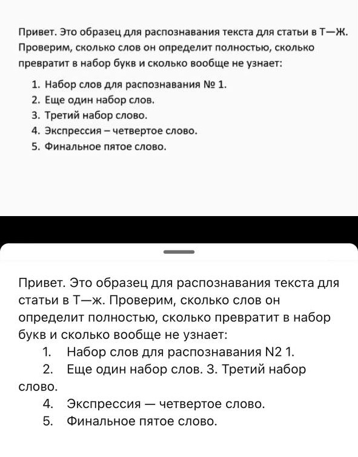

# Курсовая работа по дисциплине Computer Vision

Выполнил студент группы М8О-209М-23: Союзов Владимир Александрович

## Задача:

Оптическое распознавание символов (OCR)

## Объекты:

Текст

## Сервис:

Архитектура библиотека распознования: tesseract
Для сохранения результатов используется локальное хранилище
Для реализации API используется фреймворк FastAPI
Развертывание сервиса в docker/docker-compose для удобства Task

## Функционал сервиса:

С помощью API пользователь загружает изображение текста. Сервис производит обработку и создает файл изображения на локальном хранилище. В модуле service происходит обработка и API возвращает json объект со string-текстом преобразованным из изображения.

## Запуск сервиса:

Необходимо в терминале ввести:  docker-compose up app
Зайти в браузере на http://localhost:8000/docs
После попадания в Swagger можно пользоваться API

## Результаты работы сервиса:

загружаем изображение:

получаем:

	
Response body
Download
{
  "extracted_text": [
    "Привет. Это образец для распознавания текста для статьи в ТЖ.",
    "Проверим, сколько слов он определит полностью, сколько",
    "превратит в набор букв и сколько вообще не узнает:",
    "1. Набор слов для распознавания № 1.",
    "2. Еще один набор слов.",
    "3. Третий набор слово.",
    "4, Экспрессия — четвертое слово.",
    "5. финальное пятое слово,",
    "Привет. Это образец для распознавания текста для",
    "статьи в Т—ж. Проверим, сколько слов он",
    "определит полностью, сколько превратит в набор",
    "букв и сколько вообще не узнает:",
    "1. Набор слов для распознавания М2 1.",
    "2. Еще один набор слов. 3. Третий набор",
    "слово.",
    "4. Экспрессия — четвертое слово.",
    "5. Финальное пятое слово."
  ]
}
